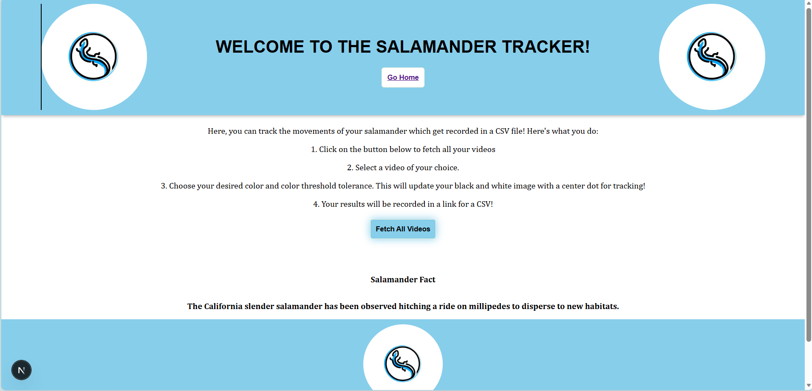
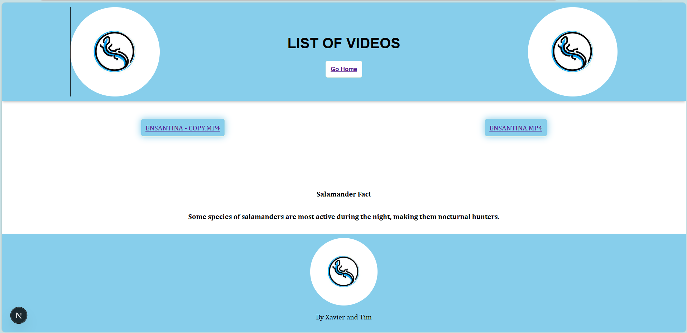
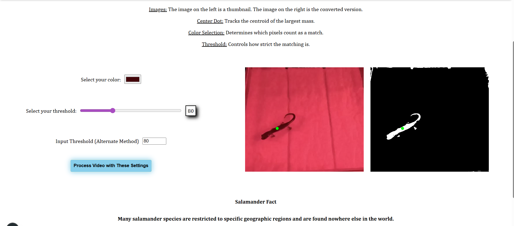
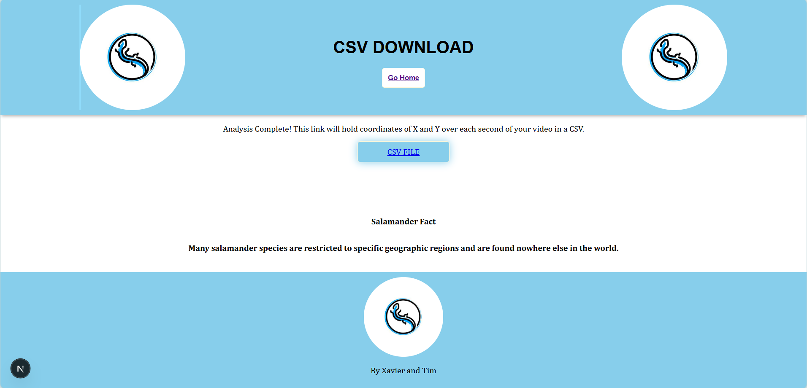

# Salamander-Tracker
Welcome to the Salamander Tracker, made by Xavier and Tim. This is an app made in collaboration with the Ohio State University for tracking salamanders to help their research. The overall goal is to display a given video you want analyzed based on the user input, and it will create a downloadable CSV with X and Y coordinates over each second of the video. Below will be the steps to help setup the project and guide through what each step means.

# Prerequisites
This may be automatically resolved in the future but it might be worth mentioning that the Docker backend component needs to be running on Docker Desktop in order for this to work. No Docker means no backend, it will not work without Docker. Again, this may be resolved in the future, but just a warning. 

Make sure you run Docker FIRST before the frontend, as Docker is strictly ran on port 3000, and next.js will automatically take the next port, 3001. If the frontend is ran first, close it down as Docker will not run on 3001.

# Hompage

This is the homepage, it includes the basic introduction, along with 2 buttons. The "Go Home" button will take the user immediately back to this page. Anytime they want to go back home to start the process, they can click here to do so. The button "Fetch All Videos" will redirect the user to the next page where they will be confronted with a list of videos that they want analyzed.

# List of Videos

This is the page where the user will select a video to analyze. This is based off of the mounted "Videos" volume folder when Docker is ran (not important but worth mentioning). Any video within that folder will be shown here. Each video will have a link that will redirect the user to the thumbnail page once clicked.

# Thumbnail/Analysis

This is the page where the user can preview the video thumbnail for analysis and change color/threshold values for analysis. It includes brief instructions for what each part means. 

This page will include the normal thumbnail of the video along with a binarized image by its side. The binarized image is the preview for what will be tracked when the user clicks "Process Video with These Settings." 

On each image is a green dot, this is the centroid. The centroid is the value that is recorded during analysis, specifically the X and Y coordinates of the centroid dot. This dot will track the largest connected group of "white mass," AKA the centroid. 

Finally, this page includes value inputs for the user. When the input changes, the binarized image and the centroid dot will be changed on live as well. The user can change the color to one that they think matches the salamander in the original thumbnail, and based on the color the binarized image will change. The threshold is a "tolerance" for how closely colors can match, and when changed the binarized image will change as well. A low threshold will be more exclusive on differing colors, while a higher threshold will be more inclusive of differing colors. An input box is here for users who want to be more precise. 

The best course of action is to choose a color that fits the salamander along with a threshold that fairly inclusive. The binarized image should only include the object they want to track, like the salamander. There should be a good outline of the salamander in white while also excluding any other groups of "white mass" that may interfere with analysis to the best of the user's ability.

# CSV Download

Once the user clicks "Process Video with These Settings," the analysis begins. The page will prompt the user that it is processing the video, and eventually it will return either a success or an error. A success prompts the user with a downloadable CSV file of their video. This includes the X and Y coordiantes of what was tracked over each second of the video. An error will only return if the video was too large to process, in which the user is prompted that an error occurred while processing. If the processing takes around 5 minutes, it will return an error.